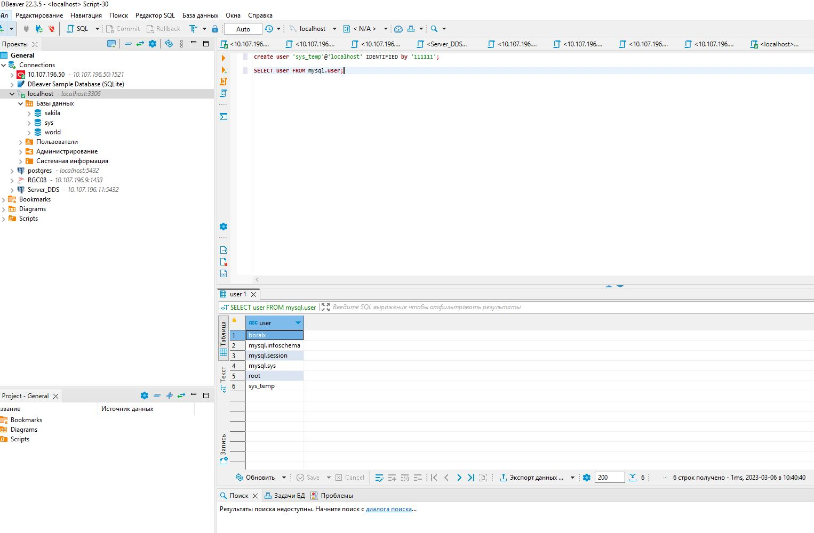
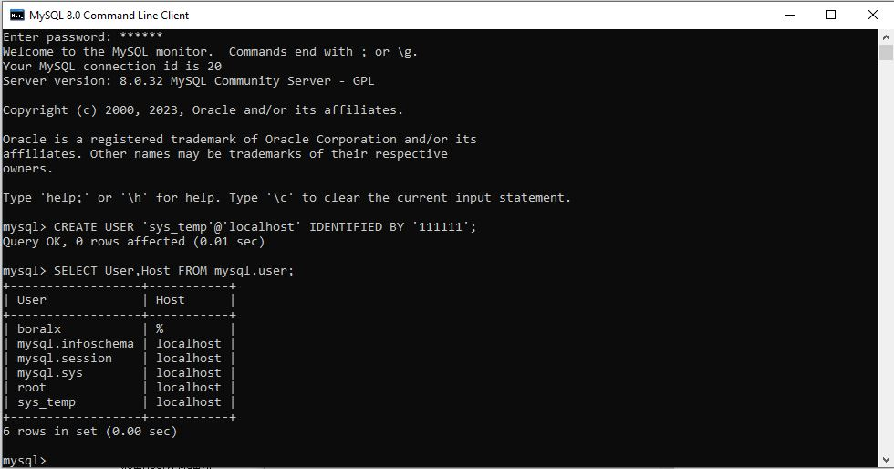
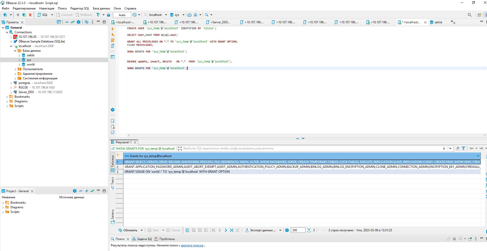

# ` Домашнее задание к занятию 12.2. «Работа с данными (DDL/DML) - Борисов Александр`

### Легенда
### Заказчик передал вам [файл в формате Excel](https://github.com/netology-code/sdb-homeworks/blob/main/resources/hw-12-1.xlsx), в котором сформирован отчёт.

### На основе этого отчёта нужно выполнить следующие задания.

## Задание 1 

`1.1. Поднимите чистый инстанс MySQL версии 8.0+. Можно использовать локальный сервер или контейнер Docker.`

`1.2. создать учётную запись sys_temp.`

`1.3. Выполните запрос на получение списка пользователей в базе данных. (скриншот)`

`1.4. Дайте все права для пользователя sys_temp.`

`1.5. Выполните запрос на получение списка прав для пользователя sys_temp. (скриншот)`

`1.6. Переподключитесь к базе данных от имени sys_temp.`

`Для смены типа аутентификации с sha2 використовуйте запрос:`

`ALTER USER 'sys_test'@'localhost' IDENTIFIED WITH mysql_native_password BY 'password';`

`1.6. По ссылке https://downloads.mysql.com/docs/sakila-db.zip скачайте базу данных.`

`1.7. Восстановите дамп на базе данных.`

`1.8. При работе в IDE сформируйте ER-диаграмму получения базы данных. При работе в базе командной строки викоруйте команду для получения всех таблиц данных. (скриншот)`

`Результатом работы должны быть скриншоты заданных заданий, а также простыня со всеми запросами.`

## Простыня с запросами [script](Script.sql)

## Задание 2

`Составьте таблицу, используя любой текстовый редактор или Excel, в которой должно быть два столбца: в первом должны быть названия таблиц восстановленной базы, во втором названия первичных ключей этих таблиц.`
## [Файл с ответом](task_2.xls)

## Задание 3

`3.1. Уберите у пользователя sys_temp права на внесение, изменение и удаление данных из базы sakila.`

`3.2. Выполните запрос на получение списка прав для пользователя sys_temp. (скриншот)`

`Результатом работы должны быть скриншоты заданных заданий, а также простыня со всеми запросами.`
